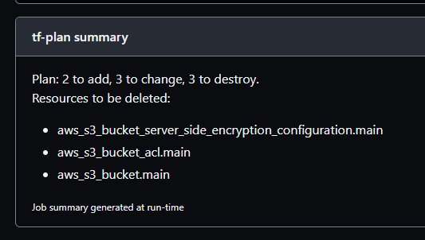

# TERRAFORM-PLAN-GH-ACTION

Repository containing Ohpen's Github Action to plan Terraform configuration with Ohpen standard.

- [TERRAFORM-PLAN-GH-ACTION](#TERRAFORM-PLAN-GH-ACTION)
  - [code-of-conduct](#code-of-conduct)
  - [github-action](#github-action)
    - [create-a-destroy-plan](#create-a-destroy-plan)
    - [integration-with-gitHub-job-summary](#integration-with-gitHub-job-summary)
    - [outputs](#outputs)

## code-of-conduct

Go crazy on the pull requests :) ! The only requirements are:

> - Use _conventional-commits_.
> - Include _jira-tickets_ in your commits.
> - Create/Update the documentation of the use case you are creating, improving or fixing. **[Boy scout](https://biratkirat.medium.com/step-8-the-boy-scout-rule-robert-c-martin-uncle-bob-9ac839778385) rules apply**. That means, for example, if you fix an already existing workflow, please include the necessary documentation to help everybody. The rule of thumb is: _leave the place (just a little bit)better than when you came_.

## github-action

This action performs a [_terraform plan_](https://www.terraform.io/cli/commands/plan) on the IAC that is specified. The inputs are:

- _region_: aws region name.
- _access-key_: user access key to be used.
- _secret-key_: user secret key to be used.
- _terraform-folder_: folder where the terraform configuration is.
- _backend-configuration_: path of the tfvars file with backend configuration.
- _terraform-var-file_: tfvars file to use as variables input.
- _terraform-plan-file_: File where terraform will write down the plan.
- _session-name_: (OPTIONAL) If provided, terraform will use it as session tag when managing the terraform backend (if an IAM role is used to do so).
- _skip-summary-if-no-changes_: (OPTIONAL) If provided, terraform will not print a [GitHub Job Summary](#integration-with-github-job-summary) when TF plan output _Plan: 0 to add, 0 to change, 0 to destroy_.
- - _skip-summary_: (OPTIONAL) If provided, terraform will not print a [GitHub Job Summary](#integration-with-github-job-summary).

⚠️ Attention! Terraform will try to assume the deployment role in the destination AWS account. Such deployment will fail if the user is not allowed to assume such role.

Here is an example:

```yaml
name: CI
on:
  pull_request:
    branches: ["main"]
jobs:
  plan-team-branch-deployment:
    needs: [configure-team-branch-environment, download-artifacts]
    runs-on: ubuntu-latest
    steps:
      - uses: actions/checkout@v2
      - uses: actions/download-artifact@v2
        with:
          name: deployment-folder
          path: deployment-folder
      - uses: actions/download-artifact@v2
        with:
          name: deployment-team-branch-conf
          path: deployment-team-branch-conf
      - uses: ohpensource/terraform-plan-gh-action@0.2.0.0
        name: terraform plan
        with:
          region: $REGION
          access-key: $COR_AWS_ACCESS_KEY_ID
          secret-key: $COR_AWS_SECRET_ACCESS_KEY
          terraform-folder: "deployment-folder/terraform"
          backend-configuration: "deployment-team-branch-conf/backend.tf"
          terraform-var-file: "deployment-team-branch-conf/terraform.tfvars"
          terraform-plan-file: "deployment-team-branch-plan/tfplan"
          skip-summary-if-no-changes: false
          skip-summary: false
          session-name: "my-session-name"
```

### create-a-destroy-plan

you can provide the parameter `destroy-mode: "true"`. Full example:

```yaml
name: CI
on:
  pull_request:
    branches: ["main"]
jobs:
  plan-team-branch-deployment:
    needs: [configure-team-branch-environment, download-artifacts]
    runs-on: ubuntu-latest
    steps:
      - uses: actions/checkout@v2
      - uses: actions/download-artifact@v2
        with:
          name: deployment-folder
          path: deployment-folder
      - uses: actions/download-artifact@v2
        with:
          name: deployment-team-branch-conf
          path: deployment-team-branch-conf
      - uses: ohpensource/terraform-plan-gh-action@0.1.0.0
        name: terraform plan
        with:
          region: $REGION
          access-key: $COR_AWS_ACCESS_KEY_ID
          secret-key: $COR_AWS_SECRET_ACCESS_KEY
          terraform-folder: "deployment-folder/terraform"
          backend-configuration: "deployment-team-branch-conf/backend.tf"
          terraform-var-file: "deployment-team-branch-conf/terraform.tfvars"
          terraform-plan-file: "deployment-team-branch-plan/tfplan"
          skip-summary-if-no-changes: false
          skip-summary: false
          destroy-mode: true
```

### Integration with GitHub Job Summary

In case the terraform plans schedule any resource change as create, update, or delete, the terraform message and the resources to be deleted will be added as a Job Summary. Next is an example:



#### Terraform plan is parsed for the summary

The terraform plan is parsed by `./tf-show-parser/main.js` to extract the summary data. It requires `@actions/core` library for setting the output. In case you want to modify it, move to `./tf-show-parser`, execute `npm install` inside that folder, edit the code and run `npm run prepare` for compiling the code.

> The JS code and the required libraries (`@actions/core`) are compiled into `./.dist` folder

### Outputs

- **changes-detected**: true if terraform plan any creation, modification or deletion
- **resources-to-add**: number of resources to be created
- **resources-to-change**: number of resources to be modified
- **resources-to-delete**: number of resources to be deleted

